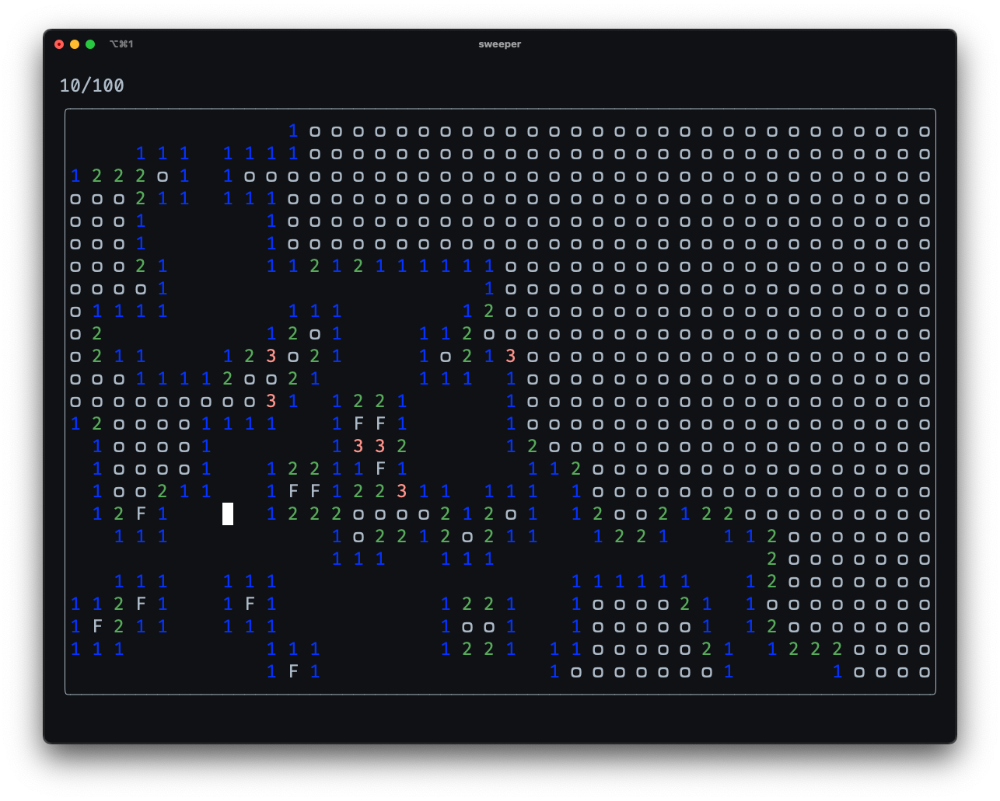

# Sweeper 

Play Minesweeper inside your terminal.



## Getting Started

### Dependencies

Make sure to have go downloaded and installed ([download here](https://go.dev/doc/install))

### Installing

First clone the repo
```bash
git clone https://github.com/jnarcher/sweeper
```
Then enter the directory and build the executable
```bash
cd sweeper && make
```
The executable can be found in the `target` directory.

### Usage

The following flags can be set to configure the board:
- `w` : width  (columns)
- `h` : height (rows)
- `b` : number of bombs

If no value for the number of bombs is provided, the program will default to 1/6th of the total squares available.

Example:
```bash
./sweeper -w 20 -h 20 -b 50
```
This will create a minesweeper game in a grid of 20 columns by 20 rows with 50 bombs.

### Controls

To move the cursor around the grid you can use the following options for up, left, down, and right respectively:
- `w, a, s, d`
- `h, j, k, l`
- arrow keys

To mark a bomb with a flag use the enter key.

To reveal a square, use the space bar. Pressing the reveal key on an already revealed square will reveal all surrounding unflagged squares (use with caution).
